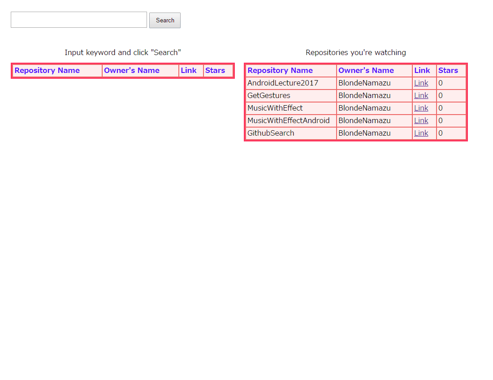

# はじめに
これは2017年度Wantedly Summer Internship (Reactで作るWebフロントエンドコース)の選考課題提出のためのリポジトリです。
## 実装
課題として与えられた要件をすべて満たすことは出来ませんでしたが、以下の機能を実装しました。
- テキストボックスに検索キーワードを入力後、Searchボタンをクリックすることでrepositoryの検索をする
- 特定のユーザーのwatchしているrepositoryのリストを表示する

逆に、今回満たせなかった要件は以下の通りです。
- インクリメンタルサーチによる検索
- 特定ユーザーではなく、自分のwatchしているrepository一覧を表示する
- リストから各repositoryをwatch/unwatchできるようにする
- Github search APIを利用する際、Personal access tokenを使用する
- Fluxアーキテクチャで開発する

尚、オプショナルで指定された要件については実装していません。

## 各クラスについて
- App
このアプリのルートクラスです。
- TestForm
入力フォームのクラスです。
テキストボックス・Searchボタンはこのクラスのパーツです。
- ResultDisplay
検索結果表示のクラスです。
検索結果のテーブルはこのクラスのパーツです。
- WatchDisplay
watchしているrepository表示のクラスです。
watchしているrepositoryのテーブルはこのクラスのパーツです。
## デモ
このリポジトリをクローンして、リポジトリのルートで`npm start`すると起動できます。

## 工夫点等
Webアプリの開発経験のない私にとって今回の課題はやや難しく感じました。
そこで、たとえ課題として与えられた要件を満たせなくてもそれに近い機能を実装することを目指しました。
- インクリメンタルサーチについて
今回はボタンイベントの発生によって検索APIを叩くという実装にしましたが、テキストボックスに入力されたテキストが変わるイベントの発生によって
検索APIを叩けば実装できるかと考えましたが、実装には至りませんでした。
- watchしているrepositoryの一覧について
これはGithub search APIをPersonal access tokenによる認証を通して利用できていないために実装できなかったのだと考えています。
この他にもGithub search APIの利用方法で詰まってしまった事が何度かありました。
- Fluxアーキテクチャについて
Flux実装について知識が全くなく、概念について調べた上でReactを用いたFlux実装をしているサンプルアプリを変更していくことで要件を満たそうと
考えました。しかし具体的にどのような実装を行えばよいかが分からず、結局Fluxアーキテクチャによる開発にはなりませんでした。
- gitについて
今回最も自信がある点です。
まず基盤の作成をmasterブランチにて行い、その後ブランチを切って各機能の実装などを行い、形になった時点でmasterブランチにマージするという形をとりました。
今回は一人での開発であったため結局commitTreeはほとんど一直線になってしまいましたが、Reactを用いたフロントエンド開発ではまず
UIパーツの設計を考え、それに機能を追加していく形の開発が良いと考えその順に作業を行いました。